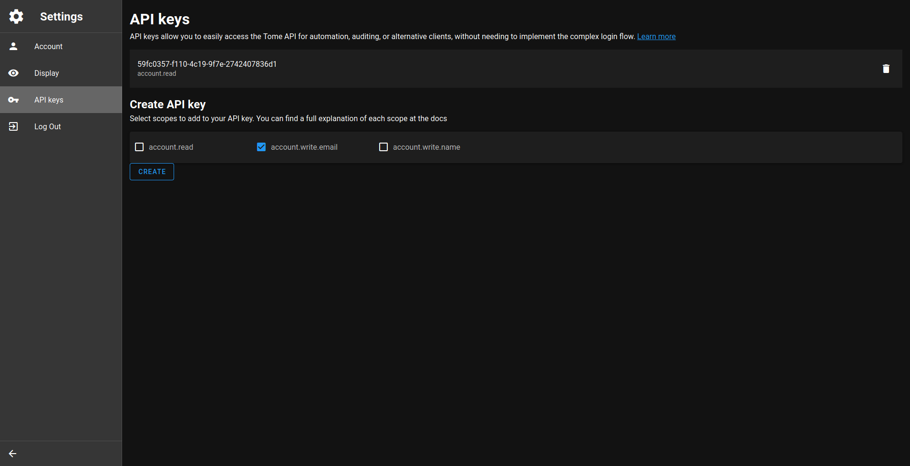

# API keys
API keys allow you to easily access the Tome API for automation, auditing, or alternative clients, without needing to implement the complex login flow. You can manage your API keys on the Settings page at `/settings/apikeys`:

When you create an API key you must choose which scopes to give. Scopes limit the access granted by an API key. You should choose the minimum set of scopes that will get the job done, because if the API key gets into the wrong hands, an attacker could pretend to be you and take control of your account.

## List of Scopes
- `account.read` - allows to read account name and email
- `account.write.email` - allows to change account email address
- `account.write.name` - allows to change account name

## Forbidden Actions
There are a few actions that cannot be performed by API keys:
- managing API keys themselves
- deleting the account
- changing the account's password

<!-- TODO(pxeger) rethink this - is there more of a use case here than an attack surface? -->
